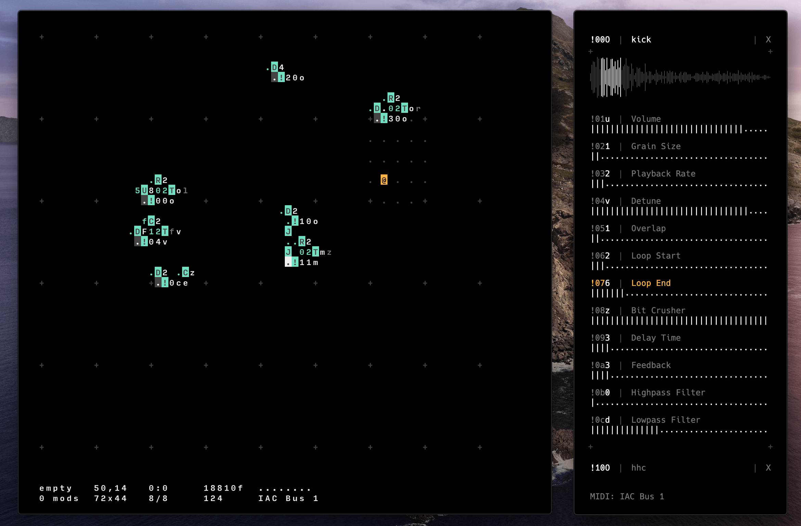

# cassetter

Cassetter is a MIDI controlled granular sampler. It was created as a companion application to the livecoding environment [ORCΛ](https://github.com/hundredrabbits/Orca).



Powered by [ToneJS](https://tonejs.github.io/), [Svelte](https://svelte.dev/) and [Electron](https://electronjs.org/).

## Installation

```sh
# Install dependencies
npm install

# Start the app
npm run dev
```

or [download](https://person0b.itch.io/cassetter)

## Usage

First you need to select the folder in which the required samples are stored in the wav format. Now you can select a sample for each channel.

The sampler receives MIDI CC signals. Knob 0 starts the sample, the rest set the parameter value.

Knob 0 has 4 values:

- `o` - Play a sample once;
- `l` - Play a sample loop;
- `r` - Play a sample once in reverse;
- `q` - Play a sample loop in reverse;

For example, a signal `!40o` will play a sample on channel 4 once.

Other values will stop playback.

Other knobs range from `0` to `z`.

### Hotkey:

- `Ctrl or Cmd + f` - Select the sample folder
- `Ctrl or Cmd + s` - Save parameters
- `Ctrl or Cmd + o` - Open a parameter file
- `Shift + ↑ or ↓` - Channel selection
- `↑ or ↓` - Selecting a parameter or a sample
- `← or →` - Change a parameter

## Issues and review are welcome!
